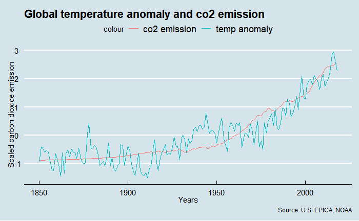

# README

These are sources being used as dataset

----------------------------------------------------------------------------------------------------------
1. ANNUAL CO2 EMISSIONS DATA
----------------------------------------------------------------------------------------------------------
Variable description	Annual production-based emissions of carbon dioxide (CO₂), measured in tonnes per year.
Variable time span	1751 – 2018
Unit conversion factor for chart	1000000
Data published by	Our World in Data based on Global Carbon Project; Carbon Dioxide Information Analysis Centre; BP; Maddison; UNWPP

This dataset has been compiled by Our World in Data based on several sources.

CO2 emissions data is sourced from the Global Carbon Project and the Carbon Dioxide Information Analysis Centre (CDIAC).
– Data from pre-1959 is sourced from the archived Carbon Dioxide Information Analysis Centre (CDIAC). Reference: Tom Boden and Bob Andres (Oak Ridge National Laboratory); Gregg Marland (Appalachian State University). Available at: http://cdiac.ornl.gov/
– Data post-1959 is sourced from the Global Carbon Project. Global Carbon Project. (2019). Supplemental data of Global Carbon Budget 2019 (Version 1.0) [Data set]. Global Carbon Project. https://doi.org/10.18160/gcp-2019.

Data has been converted by Our World in Data from tonnes of carbon to tonnes of carbon dioxide (CO₂) using a conversion factor of 3.664.

"Statistical differences" are referred to by the Global Carbon Project as the difference between global emissions and the sum of all national emissions plus bunker fuels: this discrepancy is therefore categorized as "statistical differences".

Our World in Data have renamed the category "bunker fuels" as "International transport" which includes emissions from international aviation and shipping. We have renamed this category for clarity.

Each country and region's share of global carbon dioxide (CO₂) has been calculated by Our World in Data based on annual national emissions data published by the Global Carbon Project (GCP). This is calculated as each country's share of the sum of all country emissions plus international aviation and shipping ('bunkers') and 'statistical differences'.

Consumption-based emissions are national or regional emissions which have been adjusted for trade (i.e. territorial/production emissions minus emissions embedded in exports, plus emissions embedded in imports). If a country's consumption-based emissions are higher than its production emissions it is a net importer of carbon dioxide.

The underlying source is an updated version of the paper by "Peters et al. (2011). Growth in emission transfers via international trade from 1990 to 2008." This updated data is available in the latest version of the Global Carbon Budget.

Our World in Data has calculated several additional metrics based on the following metrics:
– Energy consumption data from BP Statistical Review of World Energy: https://www.bp.com/en/global/corporate/energy-economics/statistical-review-of-world-energy.html
– Long-term GDP data from Maddison Project Database: https://www.rug.nl/ggdc/historicaldevelopment/maddison/releases/maddison-project-database-2018
– Population data from the UN World Population Prospects and Gapminder.
https://www.gapminder.org/
https://population.un.org/wpp/

----------------------------------------------------------------------------------------------------------
2. MEDIAN TEMPERATURE ANOMALY FROM 1961-1990 AVERAGE
----------------------------------------------------------------------------------------------------------
Variable time span	1850 – 2019
Data published by	Met Office Hadley Centre
Link	https://www.metoffice.gov.uk/hadobs/hadcrut4/index.html
Temperature anomalies are based on the HadCRUT4 land-sea dataset as published by the Met Office Hadley Centre. Temperature anomalies are given in degrees celcius relative to the average temperature over the period 1961-1990. These are available at the global level, for the Northern Hemisphere, South Hemisphere, and Tropics (defined as 30 degree north and south of the equator).

The median temperature anomaly, as well as the upper and lower bound anomalies (with a 95% confidence interval) are provided.

Full details of the source of this dataset is available in the following paper:
Morice, C. P., J. J. Kennedy, N. A. Rayner, and P. D. Jones (2012), Quantifying uncertainties in global and regional temperature change using an ensemble of observational estimates: The HadCRUT4 dataset, J. Geophys. Res., 117, D08101, doi:10.1029/2011JD017187.

UPPER BOUND (95% CI)
Variable time span	1850 – 2019
Data published by	Met Office Hadley Centre
Link	https://www.metoffice.gov.uk/hadobs/hadcrut4/index.html
Temperature anomalies are based on the HadCRUT4 land-sea dataset as published by the Met Office Hadley Centre. Temperature anomalies are given in degrees celcius relative to the average temperature over the period 1961-1990. These are available at the global level, for the Northern Hemisphere, South Hemisphere, and Tropics (defined as 30 degree north and south of the equator).

The median temperature anomaly, as well as the upper and lower bound anomalies (with a 95% confidence interval) are provided.

Full details of the source of this dataset is available in the following paper:
Morice, C. P., J. J. Kennedy, N. A. Rayner, and P. D. Jones (2012), Quantifying uncertainties in global and regional temperature change using an ensemble of observational estimates: The HadCRUT4 dataset, J. Geophys. Res., 117, D08101, doi:10.1029/2011JD017187.

LOWER BOUND (95% CI)
Variable time span	1850 – 2019
Data published by	Met Office Hadley Centre
Link	https://www.metoffice.gov.uk/hadobs/hadcrut4/index.html
Temperature anomalies are based on the HadCRUT4 land-sea dataset as published by the Met Office Hadley Centre. Temperature anomalies are given in degrees celcius relative to the average temperature over the period 1961-1990. These are available at the global level, for the Northern Hemisphere, South Hemisphere, and Tropics (defined as 30 degree north and south of the equator).

The median temperature anomaly, as well as the upper and lower bound anomalies (with a 95% confidence interval) are provided.

Full details of the source of this dataset is available in the following paper:
Morice, C. P., J. J. Kennedy, N. A. Rayner, and P. D. Jones (2012), Quantifying uncertainties in global and regional temperature change using an ensemble of observational estimates: The HadCRUT4 dataset, J. Geophys. Res., 117, D08101, doi:10.1029/2011JD017187.
